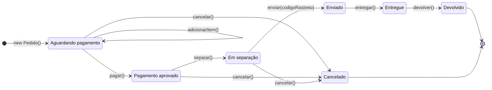
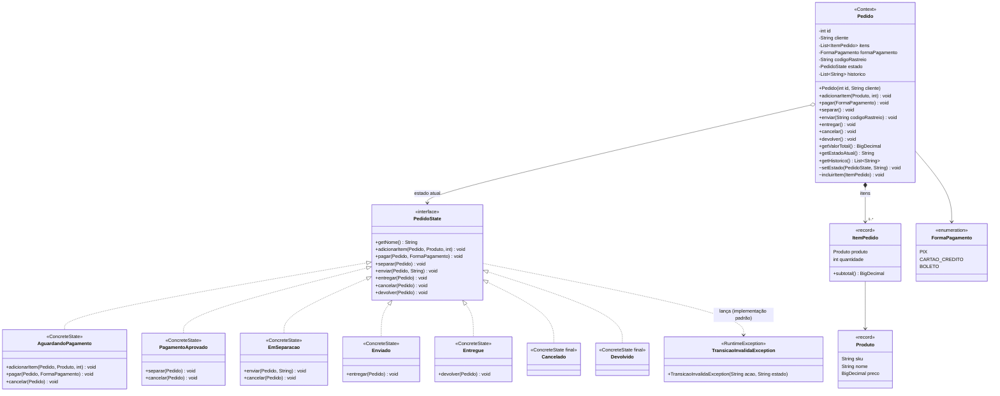

## Diagrama de estados

```mermaid
stateDiagram-v2
    direction LR

    state "Aguardando pagamento" as AguardandoPagamento
    state "Pagamento aprovado" as PagamentoAprovado
    state "Em separação" as EmSeparacao
    state "Enviado" as Enviado
    state "Entregue" as Entregue
    state "Cancelado" as Cancelado
    state "Devolvido" as Devolvido

    [*] --> AguardandoPagamento : new Pedido()
    AguardandoPagamento --> AguardandoPagamento : adicionarItem()
    AguardandoPagamento --> PagamentoAprovado : pagar()
    PagamentoAprovado --> EmSeparacao : separar()
    EmSeparacao --> Enviado : enviar(codigoRastreio)
    Enviado --> Entregue : entregar()
    Entregue --> Devolvido : devolver()

    AguardandoPagamento --> Cancelado : cancelar()
    PagamentoAprovado --> Cancelado : cancelar()
    EmSeparacao --> Cancelado : cancelar()

    Devolvido --> [*]
    Cancelado --> [*]
```

## Diagrama de classes

```mermaid
classDiagram
    direction TB

    class Pedido {
        <<Context>>
        -int id
        -String cliente
        -List~ItemPedido~ itens
        -FormaPagamento formaPagamento
        -String codigoRastreio
        -PedidoState estado
        -List~String~ historico
        +Pedido(int id, String cliente)
        +adicionarItem(Produto, int) void
        +pagar(FormaPagamento) void
        +separar() void
        +enviar(String codigoRastreio) void
        +entregar() void
        +cancelar() void
        +devolver() void
        +getValorTotal() BigDecimal
        +getEstadoAtual() String
        +getHistorico() List~String~
        ~setEstado(PedidoState, String) void
        ~incluirItem(ItemPedido) void
    }

    class PedidoState {
        <<interface>>
        +getNome() String
        +adicionarItem(Pedido, Produto, int) void
        +pagar(Pedido, FormaPagamento) void
        +separar(Pedido) void
        +enviar(Pedido, String) void
        +entregar(Pedido) void
        +cancelar(Pedido) void
        +devolver(Pedido) void
    }

    class AguardandoPagamento {
        <<ConcreteState>>
        +adicionarItem(Pedido, Produto, int) void
        +pagar(Pedido, FormaPagamento) void
        +cancelar(Pedido) void
    }
    class PagamentoAprovado {
        <<ConcreteState>>
        +separar(Pedido) void
        +cancelar(Pedido) void
    }
    class EmSeparacao {
        <<ConcreteState>>
        +enviar(Pedido, String) void
        +cancelar(Pedido) void
    }
    class Enviado {
        <<ConcreteState>>
        +entregar(Pedido) void
    }
    class Entregue {
        <<ConcreteState>>
        +devolver(Pedido) void
    }
    class Cancelado {
        <<ConcreteState final>>
    }
    class Devolvido {
        <<ConcreteState final>>
    }

    class ItemPedido {
        <<record>>
        Produto produto
        int quantidade
        +subtotal() BigDecimal
    }
    class Produto {
        <<record>>
        String sku
        String nome
        BigDecimal preco
    }
    class FormaPagamento {
        <<enumeration>>
        PIX
        CARTAO_CREDITO
        BOLETO
    }
    class TransicaoInvalidaException {
        <<RuntimeException>>
        +TransicaoInvalidaException(String acao, String estado)
    }

    Pedido o--> PedidoState : estado atual
    Pedido *--> "0..*" ItemPedido : itens
    Pedido --> FormaPagamento
    ItemPedido --> Produto

    PedidoState <|.. AguardandoPagamento
    PedidoState <|.. PagamentoAprovado
    PedidoState <|.. EmSeparacao
    PedidoState <|.. Enviado
    PedidoState <|.. Entregue
    PedidoState <|.. Cancelado
    PedidoState <|.. Devolvido
    PedidoState ..> TransicaoInvalidaException : lança (implementação padrão)
```
