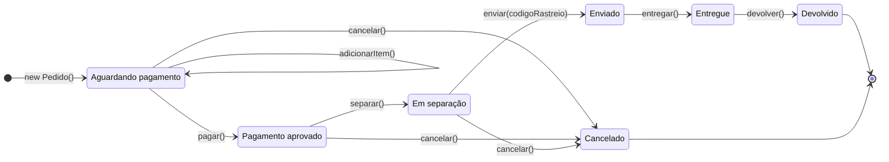

## Diagrama de estados



### Tabela de operações por estado

| Estado atual          | adicionarItem | pagar | separar | enviar | entregar | cancelar  | devolver |
|-----------------------|:-------------:|:-----:|:-------:|:------:|:--------:|:---------:|:--------:|
| Aguardando pagamento  | ✓ (mesmo estado) | Pagamento aprovado | ✗ | ✗ | ✗ | Cancelado | ✗ |
| Pagamento aprovado    | ✗ | ✗ | Em separação | ✗ | ✗ | Cancelado | ✗ |
| Em separação          | ✗ | ✗ | ✗ | Enviado | ✗ | Cancelado | ✗ |
| Enviado               | ✗ | ✗ | ✗ | ✗ | Entregue | ✗ | ✗ |
| Entregue              | ✗ | ✗ | ✗ | ✗ | ✗ | ✗ | Devolvido |
| Cancelado *(final)*   | ✗ | ✗ | ✗ | ✗ | ✗ | ✗ | ✗ |
| Devolvido *(final)*   | ✗ | ✗ | ✗ | ✗ | ✗ | ✗ | ✗ |

`✗` = operação inválida → lança `TransicaoInvalidaException`.

Regras extras de negócio:

- `pagar()` exige ao menos um item no pedido (`IllegalStateException` caso contrário).
- `enviar()` exige um código de rastreio não vazio (`IllegalArgumentException` caso contrário).
- Cancelar após o pagamento representa estorno; cancelar em `EmSeparacao` também devolve os itens ao estoque.

## Diagrama de classes


> A interface `PedidoState` tem **métodos `default`** que lançam `TransicaoInvalidaException`.
> Cada estado concreto sobrescreve somente as operações que ele permite; os estados finais
> (`Cancelado` e `Devolvido`) não sobrescrevem nenhuma. As transições (`new PagamentoAprovado()`,
> `new Cancelado()`, etc.) estão representadas no diagrama de estados.

## Estrutura do projeto

```
statePattern/
├── pom.xml
├── README.md
└── src/main/java/org/example/
    ├── Main.java                         # demonstração dos cenários
    └── pedido/
        ├── Pedido.java                   # Context
        ├── PedidoState.java              # State (interface)
        ├── AguardandoPagamento.java      # ConcreteState (inicial)
        ├── PagamentoAprovado.java        # ConcreteState
        ├── EmSeparacao.java              # ConcreteState
        ├── Enviado.java                  # ConcreteState
        ├── Entregue.java                 # ConcreteState
        ├── Cancelado.java                # ConcreteState (final)
        ├── Devolvido.java                # ConcreteState (final)
        ├── Produto.java                  # modelo (record)
        ├── ItemPedido.java               # modelo (record)
        ├── FormaPagamento.java           # enum
        └── TransicaoInvalidaException.java
```

## Como executar

Pela IDE (IntelliJ), execute a classe `org.example.Main`, ou via Maven:

```bash
mvn compile exec:java -Dexec.mainClass=org.example.Main
```

Ou apenas com o JDK 21:

```bash
javac -encoding UTF-8 -d out $(find src -name '*.java')
java -cp out org.example.Main
```

### Cenários do `Main`

1. **Compra completa**: carrinho → pagamento via PIX → separação → envio com rastreio → entrega.
2. **Cancelamento durante a separação**: pedido pago é cancelado com estorno.
3. **Devolução após a entrega**: `Entregue` → `Devolvido`.
4. **Operações inválidas**: pagar pedido vazio, enviar sem pagar, alterar itens após o pagamento,
   enviar sem rastreio, cancelar após o envio e devolver duas vezes.

Trecho da saída:

```
Pedido #1 de Ana | 2 item(ns) | R$ 479,70 | Aguardando pagamento
Pedido #1 de Ana | 2 item(ns) | R$ 479,70 | Pagamento aprovado
Pedido #1 de Ana | 2 item(ns) | R$ 479,70 | Em separação
Pedido #1 de Ana | 2 item(ns) | R$ 479,70 | Enviado
Pedido #1 de Ana | 2 item(ns) | R$ 479,70 | Entregue

[enviar sem pagar] -> Não é possível 'enviar' quando o pedido está no estado 'Aguardando pagamento'.
[cancelar depois de enviado] -> Não é possível 'cancelar' quando o pedido está no estado 'Enviado'.
[devolver duas vezes] -> Não é possível 'devolver' quando o pedido está no estado 'Devolvido'.
```

## Como adicionar um novo estado

1. Crie uma classe que implemente `PedidoState` (ex.: `AguardandoReembolso`).
2. Sobrescreva apenas as operações permitidas nesse estado.
3. Em algum estado existente, faça `pedido.setEstado(new AguardandoReembolso(), "motivo")` na transição desejada.
4. Atualize os diagramas acima.

Nenhuma alteração é necessária em `Pedido`.
